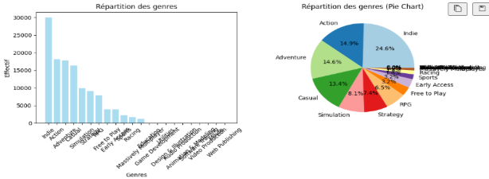
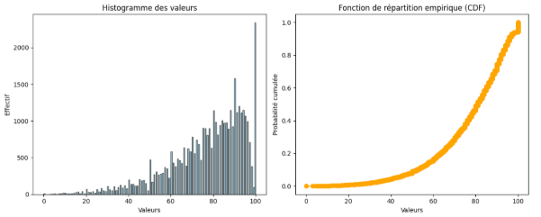
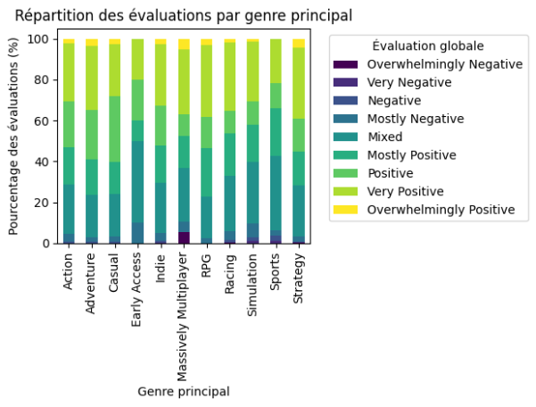
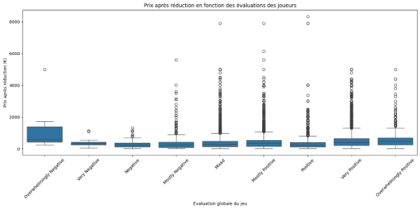
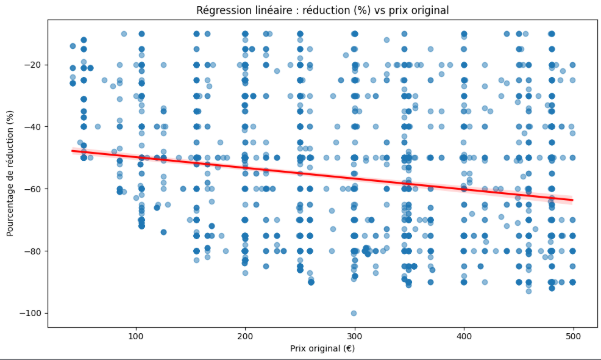
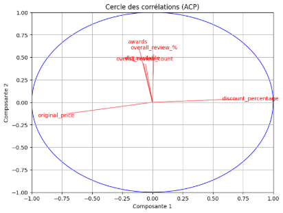
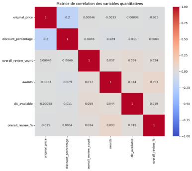
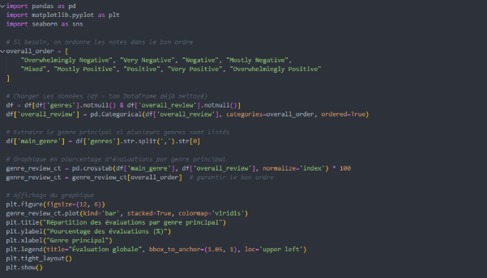
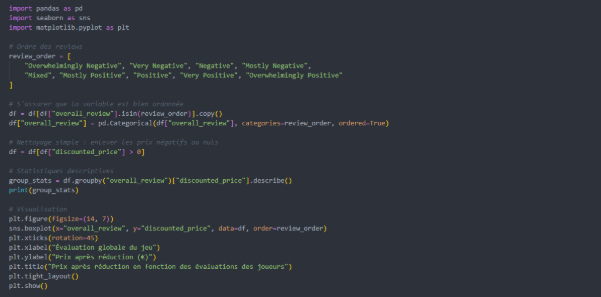
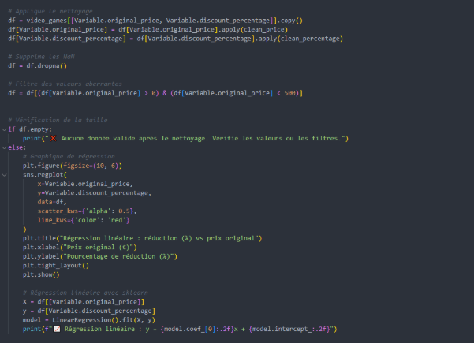

# Rapport Statistique sur les jeux vidéo

---

# Introduction
Ce rapport a pour objectif l’analyse d’un jeu de données. Notre groupe a choisi de travailler sur un jeu de données portant sur les jeux vidéo. Dans un premier temps, nous procéderons à une étude univariée de plusieurs variables afin d’en comprendre les caractéristiques individuelles. Nous enchaînerons ensuite avec des analyses bivariées et multivariées dans le but de répondre aux différentes problématiques que nous avons identifiées au cours de notre exploration.

- [Rapport Statistique sur les jeux vidéo](#rapport-statistique-sur-les-jeux-vidéo)
- [Introduction](#introduction)
- [Étude univariée](#étude-univariée)
  - [Analyse de la Variable *Genres*](#analyse-de-la-variable-genres)
  - [Analyse de la variable *Overall review percentage*](#analyse-de-la-variable-overall-review-percentage)
- [Étude bivariée](#étude-bivariée)
  - [Répartition des évaluations selon le genre de jeu](#répartition-des-évaluations-selon-le-genre-de-jeu)
    - [Objectif](#objectif)
    - [Résultats](#résultats)
    - [Conclusion](#conclusion)
  - [Étude bivariée – Relation entre l’évaluation des joueurs et le prix après réduction](#étude-bivariée--relation-entre-lévaluation-des-joueurs-et-le-prix-après-réduction)
  - [Influence du prix original sur le pourcentage de réduction des jeux vidéo](#influence-du-prix-original-sur-le-pourcentage-de-réduction-des-jeux-vidéo)
- [Étude multivariée](#étude-multivariée)
        - [Régression Linéaire Multiple](#régression-linéaire-multiple)
        - [Analyse en Composantes Principales (ACP)](#analyse-en-composantes-principales-acp)
- [Annexe](#annexe)

# Étude univariée
## Analyse de la Variable *Genres*
Dans cette partie, nous analysons la variable **genres**, une variable qualitative nominale qui décrit les catégories des jeux vidéo dans notre jeu de données. L’objectif est d’examiner la répartition des genres pour comprendre les tendances dominantes et les préférences potentielles des joueurs.

Le mode de la variable est le genre **Indie**, ce qui reflète une popularité marquée pour les jeux indépendants, souvent associés à des concepts originaux et à des coûts de développement moindre. La répartition globale montre une diversité de genres, mais avec une concentration notable sur quelques catégories principales, ce qui pourrait indiquer des préférences de marché ou une surreprésentation de certains types de jeux sur la plateforme étudiée. Pour visualiser ces résultats, des diagrammes en bâtons et circulaire ont été générés, mettant en évidence la prédominance des genres majeurs et la faible représentation des genres de niche.

## Analyse de la variable *Overall review percentage*
La variable *Overall review percentage* représente la proportion d’évaluations positives reçues par chaque jeu sur la plateforme Steam. Observée sur un échantillon de 40 020 jeux, elle est comprise entre 0 % et 100 %. Son analyse statistique met en évidence une forte tendance vers les notes élevées. En effet, la moyenne s’élève à 77,16 %, tandis que la médiane atteint 81 %, ce qui indique que plus de la moitié des jeux obtiennent au moins 81 % d’avis positifs. La valeur la plus fréquente (mode) est 100 %, soulignant une concentration importante autour de la note maximale. Cette tendance est confirmée par l’histogramme, qui montre que près de 44 % des jeux ont un score compris entre 83,33 % et 100 %, et plus de 77 % dépassent le seuil de 83,33 %.

Malgré cette prédominance de bonnes évaluations, une certaine variabilité subsiste. L’écart-type est de 17,67, l’écart interquartile atteint 23 et la variance est de 312,3, ce qui témoigne d’une dispersion modérée autour de la médiane. La distribution est asymétrique à gauche : on observe une queue étendue vers les faibles pourcentages, tandis que les valeurs élevées concentrent la majorité des observations. Cette forme pourrait s’expliquer par une tendance naturelle des joueurs à attribuer des évaluations positives ou par un biais de sélection, dans lequel les jeux populaires ou appréciés reçoivent plus de retours que ceux qui le sont moins.

En résumé, l’analyse de cette variable révèle une tendance marquée vers les scores élevés, tout en conservant une certaine dispersion. Cela suggère que si une majorité de jeux sont bien perçus, il existe également une diversité d’opinions, rendant cette variable pertinente à croiser avec d'autres pour approfondir la compréhension des facteurs influençant la satisfaction des joueurs.
# Étude bivariée
## Répartition des évaluations selon le genre de jeu
### Objectif
L’objectif de cette étude est de déterminer si certains genres de jeux sont globalement mieux évalués que d’autres par les joueurs sur Steam. Pour cela, nous croisons deux variables qualitatives :

- `genres` (nominale) – le type de jeu (Action, Simulation, RPG, etc.)
- `overall_review` (ordinale) – l’évaluation globale donnée par les joueurs
### Résultats

Le graphique ci-dessus représente la répartition des types d’évaluations (de *Overwhelmingly Negative* à *Overwhelmingly Positive*) pour chaque genre principal. On observe plusieurs tendances intéressantes :

- Les genres *Action, Adventure et RPG* sont globalement très bien perçus, avec une forte proportion d’évaluations *Positive* à *Overwhelmingly Positive*.
- À l’inverse, les jeux de type *Simulation ou Early Access* montrent une plus grande hétérogénéité dans les avis, avec une part importante de retours *Mixed* ou même *Negative*.
- Les genres Casual, *Strategy ou Sports* sont en général modérément bien notés, avec une concentration d’avis autour de *Mostly Positive* ou *Positive*, mais moins d’avis extrêmes.
### Conclusion
Cette analyse montre que le genre du jeu a une influence significative sur la perception des joueurs. Certains types de jeux semblent bénéficier d’une meilleure réception globale. Ces observations peuvent être utiles, par exemple, pour des développeurs souhaitant anticiper l’accueil de leur jeu en fonction de son positionnement sur le marché.

## Étude bivariée – Relation entre l’évaluation des joueurs et le prix après réduction
Dans le secteur des jeux vidéo, les évaluations des joueurs ont un fort impact sur la notoriété et la vente d’un titre. Un jeu très bien noté attire plus facilement de nouveaux joueurs, ce qui peut influencer la stratégie de tarification adoptée par les éditeurs, même lors de promotions.

**Problématique :**
- *Les jeux les mieux notés sont-ils vendus plus chers, même après réduction ?*

**Hypothèse formulée :**
- *Plus un jeu est bien noté (`overall_review` élevé), plus son prix après réduction (`discounted_price`) est élevé.*

L’intuition sous-jacente est que la qualité perçue d’un jeu influe sur sa capacité à conserver un prix élevé malgré les remises. Un éditeur peut se permettre de moins baisser le prix d’un jeu plébiscité par les joueurs.

L’analyse a consisté à :

- Nettoyer les valeurs aberrantes (prix ≤ 0 exclus)
- Ordonner les modalités d’évaluation
- Visualiser la distribution des prix par groupe via un boxplot
- Calculer des statistiques descriptives (moyenne, médiane, min/max, etc.)

Une tendance croissante se dessine : plus la note est élevée, plus le prix médian et moyen ont tendance à augmenter.

Les jeux “Overwhelmingly Positive” ont le prix moyen le plus élevé (582,9 €), contre 287,5 € pour les “Negative”.

Les outliers (valeurs extrêmes) sont nombreux, surtout dans les catégories les plus populaires, ce qui reflète la diversité des politiques de tarification.

Une exception surprenante : les jeux “Overwhelmingly Negative” ont un prix moyen très élevé (1356 €), mais ce résultat est probablement biaisé par la très petite taille de l’échantillon (n = 7) et quelques jeux très chers et mal notés.

**Conclusion**

L’étude valide globalement notre hypothèse : les jeux mieux notés sont en moyenne vendus plus chers, même après remise. Cela suggère que la qualité perçue d’un jeu permet à l’éditeur de maintenir un prix plus élevé, même dans un contexte promotionnel. Toutefois, les résultats doivent être nuancés par la présence d’outliers et de cas particuliers (ex : prix très élevés de jeux mal notés).

## Influence du prix original sur le pourcentage de réduction des jeux vidéo

**Problématique** 

Dans le contexte de la distribution numérique de jeux vidéo, les réductions appliquées sur les titres sont un levier marketing majeur pour attirer les consommateurs. Ces remises sont particulièrement visibles lors d’événements promotionnels majeurs comme les soldes Steam, les festivals de jeux indépendants ou les ventes flash. Cependant, une question se pose : les jeux vidéo vendus à un prix plus élevé bénéficient-ils d’un pourcentage de réduction plus important ?

Cette interrogation soulève une problématique plus large, qui concerne la stratégie commerciale des éditeurs. Ces derniers peuvent, en théorie, appliquer des réductions plus importantes sur les jeux chers afin de compenser un prix de départ dissuasif. À l’inverse, ils pourraient maintenir une réduction faible pour ne pas dévaluer la valeur perçue du produit.

Dès lors, notre problématique devient :

Les jeux vidéo les plus chers bénéficient-ils de réductions plus importantes sur les plateformes de distribution numérique ?

**Hypothèse**

À partir de cette problématique, nous formulons l’hypothèse suivante :

Plus le prix original d’un jeu est élevé, plus le pourcentage de réduction appliqué est important.

Cette hypothèse repose sur un raisonnement économique : un prix élevé peut freiner l'achat impulsif, et une forte remise pourrait alors jouer un rôle incitatif. Il est donc logique d’imaginer qu’un jeu vendu à 70 € bénéficie plus souvent de réductions de -70% ou -80% qu’un jeu initialement vendu à 5 €.

**Méthodologie** 

Pour tester cette hypothèse, nous utilisons un ensemble de données réelles contenant des informations sur un grand nombre de jeux vidéo numériques. Deux variables quantitatives continues ont été retenues :

`original_price` : le prix initial du jeu (en euros)

`discount_percentage` : le pourcentage de réduction appliqué, exprimé en % (valeurs négatives)

Certaines valeurs aberrantes ont été supprimées :

Jeux à prix nul ou très faible (≤ 0 €)

Jeux excessivement chers (> 500 €), non représentatifs du marché courant

L’étude consiste à tracer un nuage de points entre `original_price` (en abscisse) et `discount_percentage` (en ordonnée), accompagné d’une régression linéaire simple. Cela permet d’observer visuellement la tendance entre ces deux variables.

**Résultats** 

Le graphique ci-dessous illustre la relation entre le prix original et la réduction appliquée :

L’analyse révèle une tendance légèrement négative. La droite de régression obtenue montre que plus le prix d’origine augmente, plus le pourcentage de réduction a tendance à diminuer légèrement.

Les résultats vont à l’encontre de notre hypothèse initiale. Contrairement à ce que l’on pouvait attendre, les jeux les plus chers ne sont pas davantage remisés que les jeux moins onéreux, en pourcentage.

Cette observation suggère que les éditeurs préfèrent conserver une cohérence tarifaire sur leurs produits premium. Il est possible qu’une réduction trop forte sur un jeu cher nuise à sa valeur perçue, ou qu’ils ciblent une clientèle moins sensible aux remises. À l'inverse, les petits jeux, souvent indépendants, peuvent bénéficier de fortes réductions pour attirer un plus grand nombre de joueurs.

**Conclusion** 

Cette étude bivariée montre l’intérêt d’une analyse visuelle et statistique dans la compréhension des pratiques commerciales. Elle met en lumière le fait que les réductions ne sont pas nécessairement liées à un prix initial élevé, et qu’elles obéissent probablement à des logiques marketing spécifiques au type de jeu ou à la cible visée.
# Étude multivariée

**Problématique**

Comment les caractéristiques d’un jeu vidéo, telles que le prix original, le pourcentage de réduction, le nombre de critiques, les récompenses et la disponibilité de DLC, influencent-elles le pourcentage global des critiques positives (`overall_review_%`) sur une plateforme comme Steam ? L’objectif est d’identifier les facteurs clés qui contribuent à la réception critique d’un jeu.

**Hypothèse**

Nous supposons que des variables comme un prix original élevé, un pourcentage de réduction important, un grand nombre de critiques, des récompenses et la présence de DLC ont un impact significatif sur le pourcentage de critiques positives. Plus précisément, nous pensons que les jeux avec plus de critiques et de récompenses auront un meilleur pourcentage de critiques positives, tandis qu’un prix élevé pourrait avoir un effet négatif.

**Expérience**

Nous avons mené une analyse multivariée sur un jeu de données de jeux vidéo (Jeux\_Videos.csv) en utilisant deux méthodes principales :

1. **Régression linéaire multiple** : Pour quantifier l’impact des variables explicatives (`original_price`, `discount_percentage`, `overall_review_count`, `awards`, `dlc_available`) sur `overall_review_%`.
1. **Analyse en Composantes Principales (ACP)** : Pour explorer les relations entre les variables quantitatives et identifier les facteurs principaux expliquant la variabilité des données.

Les données ont été nettoyées (conversion des prix en valeurs numériques, gestion des valeurs manquantes) et standardisées avant l’analyse.

**Résultats**
##### Régression Linéaire Multiple
- **Coefficients** : 
  - `original_price` : -0.2342 (impact négatif faible)
  - `discount_percentage` : 0.1112 (impact positif faible)
  - `overall_review_count` : 0.3392 (impact positif modéré)
  - `awards` : 1.5697 (impact positif fort)
  - `dlc_available` : 0.2447 (impact positif faible)
  - Intercept : 77.3862
- **R²** : 0.0095 (seulement 0.95 % de la variabilité de `overall_review_%` est expliquée par le modèle).

Le modèle indique que les récompenses (`awards`) ont l’impact le plus significatif sur le pourcentage de critiques positives, suivies par le nombre de critiques. Cependant, le R² très faible montre que d’autres facteurs non inclus dans le modèle influencent fortement `overall_review_%`.
##### Analyse en Composantes Principales (ACP)
- **Variance expliquée** :
  - Composante 1 : 20.11 %
  - Composante 2 : 19.02 %
    Les deux premières composantes expliquent environ 39 % de la variabilité totale, ce qui est relativement faible, suggérant une forte dispersion des données.
- **Cercle des corrélations** :
  Le cercle des corrélations montre que :
  - `overall_review_count`, `awards` et `dlc_available` sont corrélés positivement entre eux et contribuent à la Composante 1.
  - `original_price` et `discount_percentage` sont opposés sur la Composante 1, indiquant une relation inverse (un prix élevé est associé à une réduction moindre).
  - `overall_review_%` est faiblement corrélé avec les autres variables, confirmant la faiblesse du modèle de régression.

- **Matrice de corrélation** :
  La matrice de corrélation confirme les observations du cercle des corrélations :
  - Forte corrélation positive entre `overall_review_count`, `awards` et `dlc_available` (coefficients entre 0.37 et 0.59).
  - Corrélation négative entre `original_price` et `discount_percentage` (-0.2).
  - Faible corrélation entre `overall_review_%` et les autres variables (coefficients < 0.24).

**Interprétation**

Les résultats montrent que les récompenses (`awards`) ont l’impact le plus notable sur le pourcentage de critiques positives, suivies par le nombre de critiques (`overall_review_count`). Cependant, le modèle de régression linéaire multiple explique très peu de la variabilité (R² = 0.0095), suggérant que d’autres facteurs, comme les genres, la qualité intrinsèque du jeu ou des variables non incluses (par exemple, la date de sortie ou la réputation du développeur), jouent un rôle plus important. L’ACP révèle des relations entre les variables explicatives (notamment entre `awards`, `overall_review_count` et `dlc_available`), mais la faible variance expliquée indique une hétérogénéité dans les données.

**Conclusion**

Bien que les récompenses et le nombre de critiques aient un effet positif sur la réception critique, leur influence reste limitée. Pour améliorer l’analyse, il serait pertinent d’inclure des variables qualitatives (comme genres ou developer) et d’explorer des modèles non linéaires ou des techniques d’apprentissage automatique pour capturer des relations plus complexes.

# Annexe

**Analyse bivariée qualitative nominale vs qualitative ordinale :**

**Analyse bivariée quantitative continue vs qualitative nominale :**

**Analyse bivariée quantitative continue vs quantitative continue :**

|Rapport Statistique|ZILBER – TRAN - TISSANDIER|
| :- | :-: |

